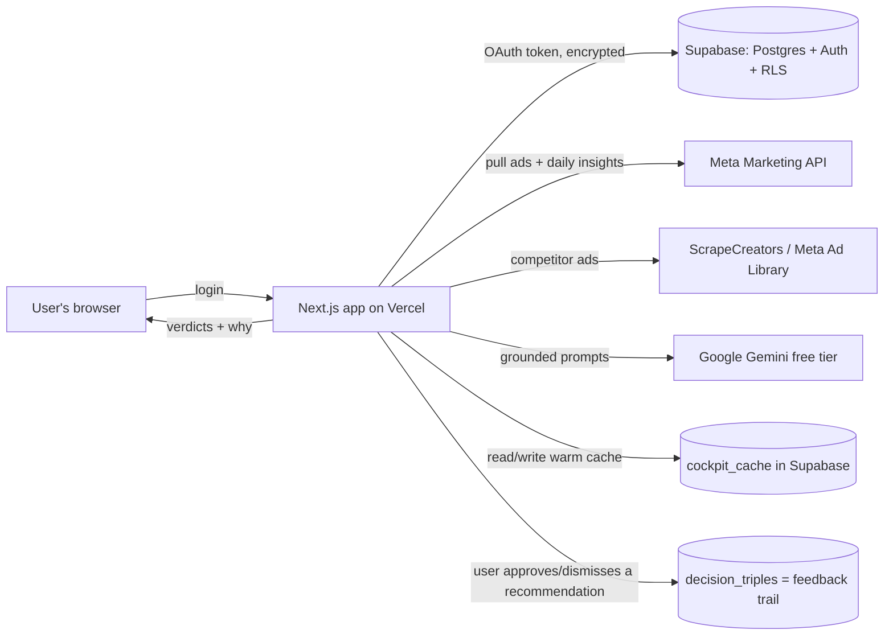

# AdBrain — Technical Handoff (for the engineer helping take this live)

*One-page brief so you can understand, in one read, what this product is, what is already built, where it
lives, what is left, and where we need your judgment. It was built almost entirely with Claude Code, so
this doc doubles as the "what a human engineer needs to own from here" map.*

Last updated: 2026-09-02 · Repo: `github.com/rahularoradigital-maker/rahul-digital` · Branch: `validation-v0-v1` (this is the live branch)

---

## 1. What AdBrain is (plain)
A web app for Meta (Facebook/Instagram) advertisers. A user connects their Meta ad account and AdBrain
reads their real ad data and tells them, in plain English, **which ads are winning, which are wasting money,
what is fatiguing, and what to test next** — plus a competitor read from the public Meta Ad Library. It is a
"creative decision co-pilot" for D2C brands and performance marketers.

- **Target users:** D2C e-commerce brands and their performance marketers / agencies (starting India, INR).
- **How it sells:** self-serve SaaS. Connect Meta in 2 clicks, see value immediately, paid tiers by ad-spend
  / number of accounts. Land via agencies (one login, many client accounts).
- **Scale target:** must comfortably serve **~500-600 users/day** as we grow (fine to start at 50-60/day for
  testing). The architecture below must get there without a rewrite.

---

## 2. What is already built (working today)
- Meta OAuth connect + multi-account switcher (a user's one token spans all their ad accounts).
- Live cockpit: account health score, blended ROAS, spend concentration, funnel metrics (thumb-stop, hold,
  LP view, add-to-cart, checkout), waste/opportunity, per-ad leaderboard with verdicts and "why" lines.
- **Ask AdBrain** — a natural-language Q&A grounded ONLY in the user's real numbers (no hallucinated data).
- **Concepts** and **Brand Brain** — AI reads the real ads and proposes 4 test recipes / a brand read.
- **Creative format diversity** (video / image / carousel / **catalog**) from real Meta creatives.
- **Competitor intelligence** from the public Meta Ad Library (via ScrapeCreators).
- Day-wise trend chart with a KPI selector; objective / campaign / date filters.
- A deterministic "brain" (rules engine) that produces the verdicts, plus a feedback/audit trail
  (**decision-triples**, below).

---

## 3. The stack (what, where, status)

| Layer | Technology | Where it lives | Status |
|---|---|---|---|
| Web app + API | **Next.js 16** (App Router), **React 19**, TypeScript | Vercel | ✅ live |
| Hosting / deploy | **Vercel** (Hobby plan), auto-deploy on git push | `rahul-digital.vercel.app` | ✅ live, but Hobby-tier limits (see §7) |
| Database + Auth | **Supabase** (Postgres + Auth + Row-Level Security) | Supabase project `gizgdgyxyqpvtgecrmik` | ✅ live |
| Ad data source | **Meta Marketing API v21** (each user's own OAuth token, encrypted at rest) | called from the app | ✅ live |
| Competitor data | **ScrapeCreators API** (Meta Ad Library) | called from the app | ✅ live (paid API key) |
| AI / LLM | **Google Gemini, FREE tier**, via REST (no SDK) — `gemini-flash-lite-latest` for text, `gemini-3.6-flash` for vision | called from the app | ⚠️ works but free-tier is the current bottleneck (see §6) |
| Caching | 2-level: in-memory (per server) + a Supabase `cockpit_cache` table | app + Supabase | ✅ live |
| Domain | **Not set up yet** — only the free `*.vercel.app` subdomain | — | 🔴 to do |
| Source control | GitHub | `rahularoradigital-maker/rahul-digital` | ✅ |
| CI | GitHub Actions (build + type-check + ~34 correctness self-checks on every push) | GitHub | ✅ green |

Secrets already configured in Vercel: Supabase keys, Meta app credentials, `GEMINI_API_KEY`,
`SCRAPECREATORS_API_KEY`, token-encryption key, a cron secret. (No secrets are in the repo.)

---

## 4. How it works (data flow)

On each page load the app pulls the account's top ads + their day-wise numbers from Meta, runs the
deterministic rules engine to score them, optionally calls Gemini for the language parts, caches the result,
and renders. Repeat visits are served instantly from cache and refreshed in the background.

---

## 5. The "brain": decision engine, decision-triples, AI pipeline (needs your view)

**What exists today (be precise — this matters):**
- The verdicts are produced by a **hand-written deterministic rules engine** in TypeScript (`lib/rules/*`,
  `lib/decision.ts`, `lib/scoring/*`, `lib/cockpit/analyze.ts`). It is NOT a machine-learning model and NOT a
  graph framework — it is explainable if/then scoring with weights. This is deliberate: every number is
  traceable, nothing is invented.
- **Gemini calls are single, independent, grounded prompts** (Ask, Concepts, Brand, and a per-creative
  "read"). They are NOT yet a multi-agent graph — there is **no LangGraph / LangChain** in the codebase today.
- **Decision-triples (our "RLEF" feedback spine):** every recommendation the app shows is logged as a
  labelled triple (state → recommendation → the user's judgment: approve / dismiss / modify) in the
  `decision_triples` table (`lib/audit/*`, `app/api/audit/judgment`). This is the data we will later use to
  learn which advice users trust. It records today; it does not yet feed back into the model.

**What the founder wants to build next (your point of view requested):**
- A **multi-agent orchestration** (LangGraph-style) where specialised sub-agents (e.g. hook-reader,
  angle-reader, fatigue-forecaster, competitor-gap, synthesizer) run and **talk to each other**, with a
  controller that guarantees **nothing breaks** (retries, timeouts, partial-failure isolation, verifiable
  outputs). Design notes are in `docs/orchestration-plan.md` and `docs/ai-audit-architecture.md`.

**Questions for you:**
1. Is a graph framework (LangGraph, or a lightweight custom orchestrator) worth it here, or do we keep
   deterministic rules + a few grounded LLM calls and add agents only where they clearly beat rules?
2. How would you make the agent pipeline **provably robust at 500-600 users/day** — per-agent timeouts,
   idempotent retries, a queue, circuit-breakers, and how to verify an agent's output before trusting it?
3. Where should the **decision-triples** feedback actually change behaviour (re-rank recommendations,
   fine-tune prompts, train a small model)?

---

## 6. The single biggest current risk: the free AI tier
Everything AI (Ask, Concepts, Brand, creative reads) runs on **Google Gemini's free tier**. Verified live:
the free quota gets exhausted (HTTP 429) and the alternate model gets overloaded (HTTP 503) under normal use.
Text tasks were moved to `gemini-flash-lite-latest` (highest free quota) as a stopgap. **For real users this
must move to a paid Gemini (or equivalent) tier with per-user quotas** — this is a founder action (billing)
plus a small code change. Related cost-control lever already designed but not built: **fingerprint-once**
(analyse each creative once and cache it, so we do not re-pay the LLM every day — ~10x fewer calls).

---

## 7. What is still needed to go live + to scale to 500-600 users/day

| Area | Needed | Why |
|---|---|---|
| Domain | Buy + connect a real domain (e.g. via Vercel or a registrar) | `*.vercel.app` is not shippable branding |
| Hosting tier | Move Vercel **Hobby → Pro** (or the equivalent) | Hobby blocks sub-daily cron, has lower limits; Pro unlocks background jobs + higher function limits |
| AI tier | **Paid Gemini** + per-user quotas + fingerprint-once cache | free tier already rate-limits at low usage (§6) |
| Background sync | A **queue + worker** that syncs Meta data on a schedule, so pages read from the DB instead of pulling Meta live on every load | this is the real "speed" fix (see §8) |
| Data tier | Connection pooling + materialised rollups + retention/partitioning as row counts grow | ~600 accounts × 60 ads × daily = a lot of rows/year |
| Monitoring | Error tracking (e.g. Sentry), uptime, per-user cost + quota dashboards | needed before real load |
| Security / compliance | Encrypted-token review, OAuth CSRF/state, privacy policy + ToS, data deletion, Meta platform-terms review | required to run a real Meta app publicly |

The full, staged plan (design-for-10k, provision-for-now) is in `docs/10x-audit-and-plan.md`,
`docs/ARCHITECTURE.md` (ADR-0004), `docs/system-design.md`, and `docs/production-readiness.md`. Start at the
"P1 (~100-1k users)" slice.

---

## 8. Does moving to AWS make it faster? (short answer: no, not by itself)
The app is already on Vercel's global edge + serverless — hosting is **not** the slow part. The slowness is
that today the app **pulls ~100 ads' daily numbers from the Meta API live, on a cold page load**. Moving the
same code to AWS runs the same slow pull on different infrastructure. The real speed wins are: (a) the
2-level cache (already in), (b) a **background sync worker** so pages read pre-computed data from the DB, and
(c) fingerprint-once for the AI. AWS becomes relevant **later**, for the worker fleet / queue at scale — as a
deliberate step in the plan, not a speed fix now. Recommendation: stay on Vercel + Supabase, add a worker
(Vercel Cron/Pro, or a small worker on Fly/Render/AWS) when background sync lands.

---

## 9. What Claude Code has done vs. what we need from you
- **Done by Claude Code:** the entire app above — UI, rules engine, Meta/Gemini/ScrapeCreators integrations,
  auth + RLS, caching, CI with ~34 self-checks, and this handoff.
- **We need a human engineer to own:** (1) the go-live checklist in §7 (domain, paid tiers, monitoring,
  security/compliance), (2) the background-sync worker + data-tier scaling, (3) a view on the AI
  orchestration + robustness in §5, and (4) a production readiness sign-off (`docs/deploy-checklist.md`,
  `docs/production-readiness.md`).

**Fastest path to a real pilot (50-60 users):** buy a domain, move Vercel to Pro, put Gemini on billing with
per-user caps, add a nightly background sync, turn on error monitoring. Everything else in §7 is the
500-600/day hardening that follows.

---

## Addendum 2026-09-02 — start here if you are joining now

**Read first:** `docs/PHASE-0-AUDIT-2026-09-02.md` (the full audit: system map, top-20 problems, what was fixed with measurements, what is still open and why) → `CHANGELOG.md` → `docs/DECISIONS.md` (D-audit-1…4 explain the caching, paging and rendering rules you must keep) → `.claude/MULTI-CHAT-PROTOCOL.md` + `.claude/WIP.md` (several Claude sessions work in this tree at once; claim hot files before editing).

**Could a strong senior engineer join tomorrow and understand, modify and deploy this safely?** Yes for understand and modify, with two caveats for deploy:
1. **Gates are the contract.** `npx tsc --noEmit`, `npm run build`, and the relevant `npm run check:<name>` (141 assert-scripts, chained in `check:all`) must be green before any push; there is no test runner yet (planned: `node --test`). Every commit today carries its gate results in the message.
2. **Two things you cannot see from the code:** (a) migrations are applied by hand in the Supabase SQL editor — `supabase/migrations/0032_*.sql` is written but NOT applied (it closes the one real cross-tenant leak); (b) the nightly `/api/cron/sync` depends on `CRON_SECRET` and Vercel Crons being enabled, and `/api/health` (admin) reports `automationStale` when it is not firing. Check both before trusting any "data is fresh" assumption.

**Invariants you must not break** (each has a check): RLS is default-deny and the service-role admin client does the real work with app-level `.eq("user_id")` scoping (`check:plane`, `check:scoping`); every product API method is gated (`check:access-gate`); `CACHE_SCHEMA` in `lib/meta-sync.ts` is bumped whenever the cached cockpit shape changes (`check:cache`); store readers page through `readAllPages` with a total order (`check:paged`); the scoring engine's golden invariants (`check:golden`, `check:shadow-benchmark`).
