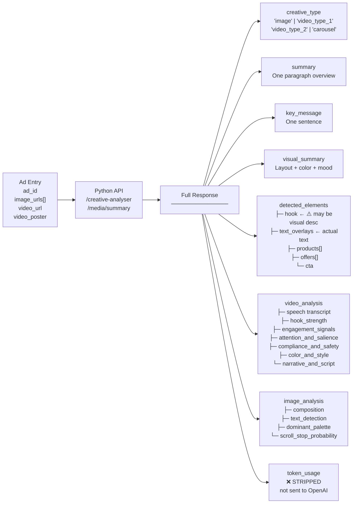
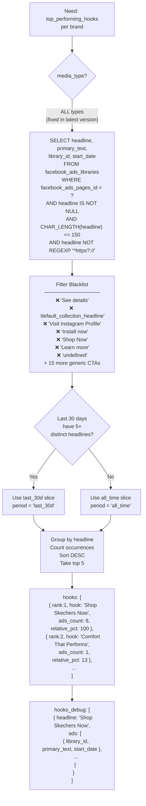
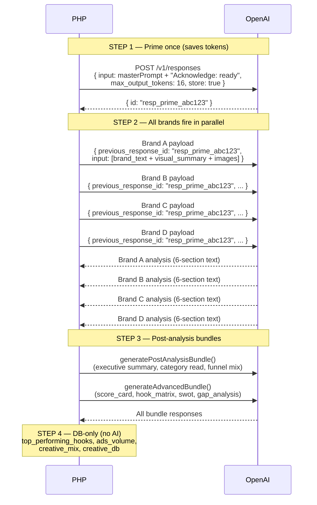
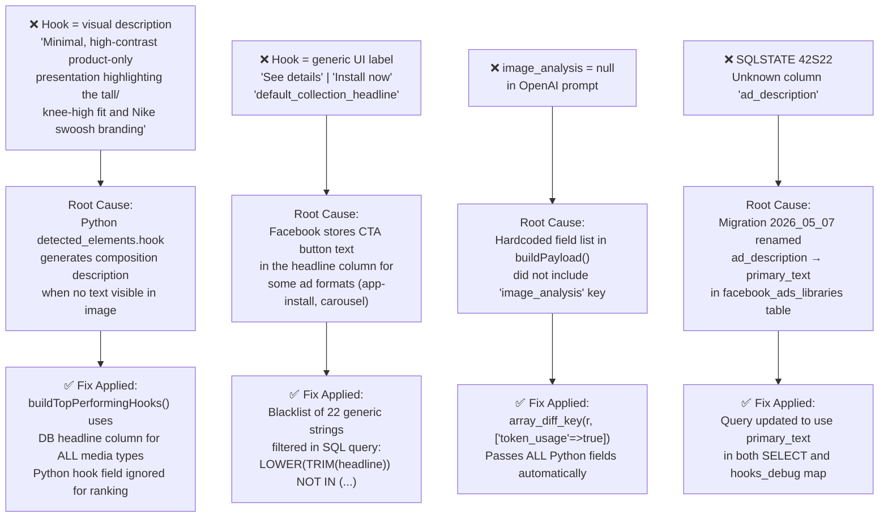
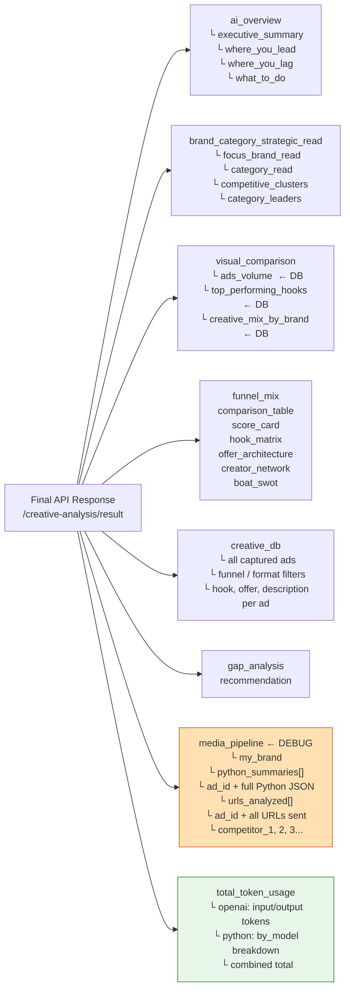

# Creative Analysis Pipeline — Flowchart

**Date:** 2026-07-10

---

## Full Pipeline (Top to Bottom)

```mermaid
flowchart TD
    START([" 🚀 POST /scan/{id}/creative-analysis\n media_type = only_image | only_text | auto "])

    START --> FETCH["📦 Fetch Ads from DB\n facebook_ads_libraries\n ─────────────────────\n Active-first, oldest start_date\n Top 10 ads per brand"]

    FETCH --> MEDIACHECK{Is media_type\nimage / video /\ncarousel / auto?}

    %% TEXT ONLY PATH
    MEDIACHECK -- "only_text" --> BUILDTEXT["📝 buildTextInput()\n ─────────────────\n ## BRAND\n Name, Category, Followers\n ## ADS (N)\n  Headline, Description,\n  CTA, Status, Platforms"]

    %% VISUAL PATH
    MEDIACHECK -- "visual type" --> EXTRACTURLS["🔗 extractImageUrls()\n ─────────────────────\n only_image  → ad_image_url\n only_video  → video_poster\n only_carousel → carousel_images\n auto  → all of the above"]

    EXTRACTURLS --> PYTHONPOOL["⚡ Http::pool() — Parallel\n POST /creative-analyser/media/summary\n ─────────────────────────────────────\n Auth: Basic user:password\n Header: x-api-token\n Body: multipart image_urls[]"]

    PYTHONPOOL --> PYTHONRESP["🐍 Python Returns Per Ad\n ─────────────────────────\n creative_type\n summary\n key_message\n visual_summary\n detected_elements:\n   • hook\n   • text_overlays\n   • products / offers / cta\n video_analysis:\n   • transcript, speaker\n   • engagement, hook_strength\n   • color, narrative, compliance\n image_analysis:\n   • composition, text_detection\n   • scroll_stop_probability\n ─ ─ ─ ─ ─ ─ ─ ─ ─ ─ ─ ─\n ❌ token_usage  STRIPPED OUT"]

    PYTHONRESP --> ASSEMBLEVIS["🔧 Assemble visualSummaryRaw\n ────────────────────────────\n[Ad 123 | status: active | running since: Jun 8]\n{\n  'creative_type': 'image',\n  'summary': '...',\n  'detected_elements': { hook, text_overlays },\n  'image_analysis': { ... }\n}\n\n --- \n\n[Ad 456 | status: active | ...]\n{ ... }"]

    ASSEMBLEVIS --> BUILDTEXT2["📝 buildTextInput()\n ─────────────────\n ## BRAND + ## ADS text\n (skipped for pure visual types)"]

    BUILDTEXT --> PRIME
    BUILDTEXT2 --> PRIME

    PRIME["🔑 primeInstructions()\n ────────────────────\n Upload MASTER PROMPT once\n → returns prime_id\n Saves (N-1) × 600 tokens\n per analysis request"]

    PRIME --> BUILDPAYLOAD

    BUILDPAYLOAD{Build OpenAI\nPayload by\nmedia_type}

    BUILDPAYLOAD -- "only_text" --> PAYLOAD_TEXT["📄 Text Payload\n ──────────────\n instructions: system_prompt\n previous_response_id: prime_id\n input: brand+ads text string\n max_output_tokens: 8192\n temperature: 0.7"]

    BUILDPAYLOAD -- "only_image\nonly_video\nonly_carousel" --> PAYLOAD_VISUAL["🖼️ Pure Visual Payload\n ──────────────────────\n instructions: system_prompt\n previous_response_id: prime_id\n input: [\n   { type: input_text,\n     text: ## VISUAL ANALYSIS\n           + visualSummaryRaw },\n   { type: input_image,\n     image_url: url_1 },\n   { type: input_image,\n     image_url: url_2 },\n   ...up to 10 images\n ]"]

    BUILDPAYLOAD -- "image_text\nvideo_text\ncarousel_text\nauto" --> PAYLOAD_COMBINED["📋 Combined Payload\n ────────────────────\n instructions: system_prompt\n previous_response_id: prime_id\n input: [\n   { type: input_text,\n     text: brand+ads text\n           + ## VISUAL ANALYSIS\n           + visualSummaryRaw },\n   { type: input_image, url_1 },\n   { type: input_image, url_2 },\n   ...up to 10 images\n ]"]

    PAYLOAD_TEXT --> OPENAI_PARALLEL
    PAYLOAD_VISUAL --> OPENAI_PARALLEL
    PAYLOAD_COMBINED --> OPENAI_PARALLEL

    OPENAI_PARALLEL["⚡ Http::pool() — All Brands Parallel\n POST /v1/responses\n ─────────────────────────────────\n Authorization: Bearer OPENAI_API_KEY\n model: gpt-5.2\n All brand payloads fire simultaneously"]

    OPENAI_PARALLEL --> OPENAI_RESP["🤖 OpenAI Returns per Brand\n ────────────────────────────\n 1. Messaging System\n    (core promise, belief map,\n     buyer motivators score)\n 2. Tone Audit\n    (tone profile, gaps,\n     competitor comparison)\n 3. Creative Diversification\n    (hook diversity 1-10,\n     format diversity 1-10,\n     angle saturation)\n 4. Hormozi Value Framework\n    (dream outcome, proof,\n     value ladder)\n 5. Top 3 Hooks\n    (production-ready,\n     psychological mechanism)\n 6. Prioritized Recommendations\n    (5-7 ranked by impact)"]

    OPENAI_RESP --> POSTBUNDLE["🔄 generatePostAnalysisBundle()\n ────────────────────────────────\n Fires 3 more parallel OpenAI calls:\n • executive_summary (ai_overview)\n • brand_category_strategic_read\n • funnel_mix + comparison_table"]

    POSTBUNDLE --> ADVANCEDBUNDLE["🔄 generateAdvancedBundle()\n ────────────────────────────\n Fires 4 more parallel OpenAI calls:\n • score_card\n • hook_matrix\n • offer_architecture + creator_network\n • boat_swot + gap_analysis + recommendation"]

    ADVANCEDBUNDLE --> DBBUILD["🗄️ Build from DB (no AI)\n ────────────────────────\n • buildAdsVolumeChart()\n • buildTopPerformingHooks()  ← DB headlines\n • buildCreativeMixByBrand()\n • buildCreativeDb()\n • buildFunnelMix()"]

    DBBUILD --> STORE["💾 Store Result in DB\n ad_analyzer_scans\n ─────────────────\n status: completed\n result: JSON\n batch_id: uuid"]

    STORE --> RESPONSE["✅ Final Response\n ─────────────────\n ai_overview\n brand_category_strategic_read\n visual_comparison\n   └ ads_volume\n   └ top_performing_hooks  ← DB\n   └ creative_mix_by_brand\n funnel_mix\n comparison_table\n score_card\n hook_matrix\n offer_architecture\n creator_network\n boat_swot\n creative_db\n gap_analysis\n recommendation\n total_token_usage\n media_pipeline  ← debug\n   └ python_summaries per ad\n   └ urls_analyzed per ad"]
```

---

## Python Per-Ad Data Structure

---

## Hook Generation Logic

---

## OpenAI Prompt Chain (Token Optimization)

---

## What Goes Wrong — Common Bug Map

---

## Response Key Map

